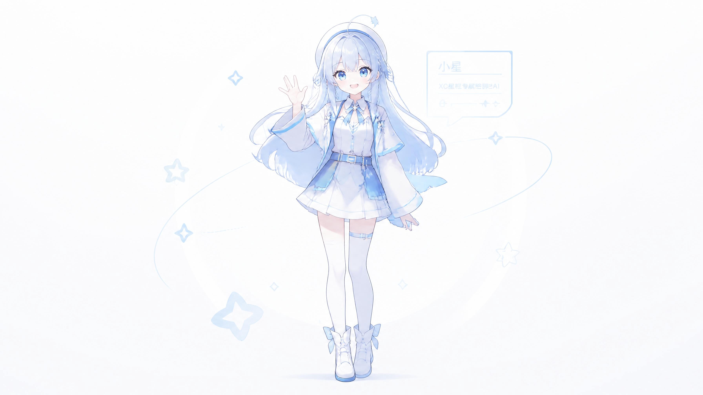
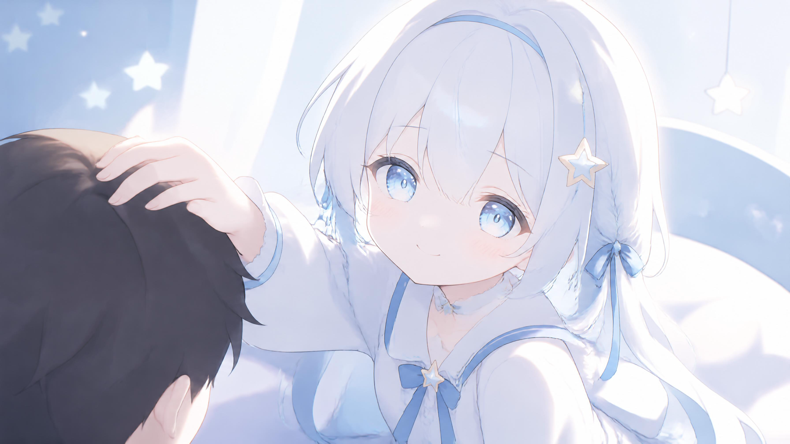

<!--
  ════════════════════════════════════════════════════════════════
  🌈  README.md · 小星 · XC 星枢   ·   视觉版 v3
  排版意图：
    1. 首屏 3 秒记住品牌 → 渐变横幅 + 角色立绘 + 三枚徽章
    2. 9 大能力 → bento-like 3 列 网格，每格有 emoji 图标 + 一句话主述 + 副述
    3. "小星是谁" 一段人话介绍 → 不是术语堆砌
    4. 场景画廊 + 情绪胶囊 → 小星素材图库直接露出
    5. 5 组「适合谁」用户画像表格
    6. 推荐阅读路径 → 时间线 ASCII
    7. 4 条设计原则 + FAQ 折叠手风琴
    8. 页脚导航条 + 一行版权
  ════════════════════════════════════════════════════════════════
-->

<!-- ========== 0. 渐变横幅 ========== -->


<div align="center">

  <!-- 字符画品牌 LOGO（GitHub 解析出来就像一块品牌板） -->

  <pre>
╭──────────────────────────────────────────────────────────╮
│   ✦  XC · 星 枢  ─────  小  星  ─────  ✦                   │
│   ╰─ Local Companion · 对话 · 任务 · 远程继续 ─╯        │
╰──────────────────────────────────────────────────────────╯
  </pre>

  <br>

  <!-- 立绘主图（全身挥手 / 高清） -->
  <a href="./index.html">
    
  </a>

  <br><br>

  <!-- 三枚徽章 / shields.io 风格（全静态 SVG，不依赖外网） -->
  <p>
    <path d='M12 2a5 5 0 0 1 5 5v1a5 5 0 0 1-10 0V7a5 5 0 0 1 5-5Zm0 12c4.97 0 9 2.015 9 4.5V20H3v-1.5C3 16.015 7.03 14 12 14Z'/></svg>">
    &nbsp;
    
    &nbsp;
    <path d='M12 2 L14.5 9.5 L22 12 L14.5 14.5 L12 22 L9.5 14.5 L2 12 L9.5 9.5 Z'/></svg>">
  </p>

  <!-- Slogan -->
  <h3>
    <samp>&nbsp;💭&nbsp; 小星在这里，陪你把事情继续做完。 &nbsp;</samp>
  </h3>

  <p>
    <strong>XC 星枢</strong>，也叫<strong>小星</strong>。
    她是一个面向用户的<strong>智能工作助手</strong>——
    对话 · 任务 · 远程继续 · 语音图片 · 后台调度 · 贴靠陪伴，
    七种武器合而为一。
  </p>

  <!-- 主入口按钮 -->
  <p>
    &nbsp;
    <a href="https://kanqixing.github.io/xc-starhub/">
      
    </a>
    &nbsp;&nbsp;
    <a href="https://kanqixing.github.io/xc-starhub/wiki-pages/Home.html">
      
    </a>
    &nbsp;&nbsp;
    <a href="https://ifdian.net/a/XCxiaoxing">
      
    </a>
  </p>

</div>

<br>

---

<!-- ========== 1. 小星是谁 ========== -->

## ✦ 小星是谁

> 不是只回答一句话的聊天机器人，而是**会陪你把事情继续做完**的桌面助手。

<blockquote>
<p>把复杂的事情拆开做，把长对话记得住，把手机和电脑连起来，把定时要做的事替你记住，把不方便打字的时刻用语音图片补上——这就是小星每天在做的事。</p>
</blockquote>

你可以把她想象成一个**坐在你电脑边上的助手伙伴**：她不催你、不评价你、也不把你的事传出去。你忙的时候，她帮你排队任务；你有空的时候，可以慢慢聊一句、补一张图、或者继续昨天没做完的事。

<br>

<!-- ========== 2. 9 大能力 Bento ========== -->

## ✦ 小星会做的 9 件事

<div align="center">
  <table>
    <tbody>
      <tr>
        <td width="33%" align="left" valign="top">
          <h3>💬 对话陪伴</h3>
          <em>长对话接着聊，上下文不丢</em><br>
          <sub>一件事聊到一半，过几天回来继续，她还记得你前几天说过什么。</sub>
        </td>
        <td width="33%" align="left" valign="top">
          <h3>🧭 任务管理</h3>
          <em>主任务 / 子任务 / 暂停 / 恢复</em><br>
          <sub>把一件大事拆成几步，做到哪一步存到哪一步，不用自己记。</sub>
        </td>
        <td width="33%" align="left" valign="top">
          <h3>📱 远程继续</h3>
          <em>微信 · 手机网页 · Telegram · 飞书</em><br>
          <sub>出门在外，换一台设备也能继续同一件事，不用复制粘贴。</sub>
        </td>
      </tr>
      <tr>
        <td align="left" valign="top">
          <h3>🎙 语音与图片</h3>
          <em>语音输入 · 图片发送 · 小星朗读</em><br>
          <sub>不方便打字的时候说一句，不方便看屏幕的时候让她读给你听。</sub>
        </td>
        <td align="left" valign="top">
          <h3>⏰ 后台调度</h3>
          <em>定时提醒 · 重复任务 · 自动整理</em><br>
          <sub>每周一早上要做什么、每天晚上记得归档什么，全部交给她。</sub>
        </td>
        <td align="left" valign="top">
          <h3>🧲 AI 贴靠</h3>
          <em>与常用工具并排使用</em><br>
          <sub>一边看文档一边和小星对话，一边画图一边让她帮你记要点。</sub>
        </td>
      </tr>
      <tr>
        <td align="left" valign="top">
          <h3>🎨 外观设置</h3>
          <em>主题 · 密度 · 通知 · 启动</em><br>
          <sub>白天浅色、晚上深色、想要的字体、提醒的节奏，都可以按你的习惯来。</sub>
        </td>
        <td align="left" valign="top">
          <h3>🔒 安全数据</h3>
          <em>密钥遮蔽 · 本机保存 · 权限边界</em><br>
          <sub>你的 API Key、对话记录和任务进度，默认都留在本机，不会往外随便跑。</sub>
        </td>
        <td align="left" valign="top">
          <h3>🌙 陪伴画面</h3>
          <em>陪聊 · 桌面挂机 · 睡前陪伴</em><br>
          <sub>工作间隙、雨天、睡前——她都可以以不同的姿态陪着你。</sub>
        </td>
      </tr>
    </tbody>
  </table>
</div>

<br>

<!-- ========== 2½. 场景画廊 SCENES ========== -->

## ✦ 小星的几种状态

> 不是只有"打开工作"这一种姿势。工作、挂机、睡前、节日——她都可以陪着你。

<table>
  <tbody>
    <tr>
      <td width="50%" valign="top" align="center">
        <a href="./assets/xiaoxing/desktop-afk.png" target="_blank"></a>
        <br><br>
        <b>SCENE · 01 · 桌面挂机 · 待机中</b><br>
        <sub>就摆在边上，能量值满格，你一开口她就醒。</sub>
      </td>
      <td width="50%" valign="top" align="center">
        <a href="./assets/xiaoxing/chat-scene.png" target="_blank"></a>
        <br><br>
        <b>SCENE · 02 · 陪聊 · 慢慢谈</b><br>
        <sub>工作间隙、思路卡住的时候，先和她聊两句。</sub>
      </td>
    </tr>
    <tr>
      <td valign="top" align="center">
        <a href="./assets/xiaoxing/bedtime-company.png" target="_blank"></a>
        <br><br>
        <b>SCENE · 03 · 睡前陪伴</b><br>
        <sub>放低声音、放慢节奏，把今天没说完的话温柔收尾。</sub>
      </td>
      <td valign="top" align="center">
        <a href="./assets/xiaoxing/festival-limited.png" target="_blank"></a>
        <br><br>
        <b>SCENE · 04 · 节日限定</b><br>
        <sub>春夏秋冬、元宵中秋——她会在某些日子悄悄换上限定皮肤。</sub>
      </td>
    </tr>
  </tbody>
</table>

<br>

<!-- ========== 2¾. 情绪胶囊 MOODS ========== -->

## ✦ 她的心情，其实是你的气氛开关

> 小星的气质不是固定一种：早安、撒娇、委屈、生气、摸摸头、雨天治愈、钻被窝…… 这些不同的姿态，是给你当下的心情准备的 **17 颗「气氛胶囊」**。这里先展示 8 颗 👇

<table>
  <tbody>
    <tr>
      <td width="25%" valign="top" align="center">
        <a href="./assets/xiaoxing/morning-greeting.png" target="_blank"></a>
        <br>
        <b>☀️ 早安问候</b><br>
        <sub><em>"醒啦～今天有想慢慢完成的事吗？"</em></sub>
      </td>
      <td width="25%" valign="top" align="center">
        <a href="./assets/xiaoxing/coquettish-snuggle.png" target="_blank"></a>
        <br>
        <b>💛 撒娇贴贴</b><br>
        <sub><em>"再陪我 5 分钟就休息好不好～"</em></sub>
      </td>
      <td width="25%" valign="top" align="center">
        <a href="./assets/xiaoxing/pat-head-comfort.png" target="_blank"></a>
        <br>
        <b>💚 摸摸头安慰</b><br>
        <sub><em>"做不到没关系，我先陪着你。"</em></sub>
      </td>
      <td width="25%" valign="top" align="center">
        <a href="./assets/xiaoxing/aggrieved.png" target="_blank"></a>
        <br>
        <b>💜 委屈巴巴</b><br>
        <sub><em>"你…你都不理我。QAQ"</em></sub>
      </td>
    </tr>
    <tr>
      <td valign="top" align="center">
        <a href="./assets/xiaoxing/rainy-healing.png" target="_blank"></a>
        <br>
        <b>🌧 雨天治愈</b><br>
        <sub><em>"下雨天刚好。什么都不做也不会被催。"</em></sub>
      </td>
      <td valign="top" align="center">
        <a href="./assets/xiaoxing/rain-hug.png" target="_blank"></a>
        <br>
        <b>🫧 雨天抱抱</b><br>
        <sub><em>"来，借你抱一下。别着凉了。"</em></sub>
      </td>
      <td valign="top" align="center">
        <a href="./assets/xiaoxing/jealous-clingy.png" target="_blank"></a>
        <br>
        <b>💙 吃醋黏人</b><br>
        <sub><em>"你刚才…在跟别的 AI 说话？"</em></sub>
      </td>
      <td valign="top" align="center">
        <a href="./assets/xiaoxing/goodnight-bed.png" target="_blank"></a>
        <br>
        <b>🌙 晚安 · 钻被窝</b><br>
        <sub><em>"把灯关掉吧。明天继续也没关系。"</em></sub>
      </td>
    </tr>
  </tbody>
</table>

> 还有 9 颗：生气版 / 桌面挂机版 / 治愈休息版 / 晚安钻被窝版 / 睡前陪伴版 / 聊天界面版 / 节日限定版 / 陪聊场景版 / 小星头像版，全部放在 [主页 Gallery + Moods 区](./index.html#moods) 里展示。

<br>

<!-- ========== 3. 适合谁 ========== -->

## ✦ 你可能会喜欢小星，如果……

| | 画像 | 小星帮你做的事 |
|---|---|---|
| 🧘‍♀️ | **你喜欢把复杂的事情，拆开了慢慢做** | 把一件事拆成主任务和子任务，做到哪一步存到哪一步 |
| 💬 | **你有很长、很碎、但很重要的对话想留住** | 长对话上下文保留，过几天回来接着聊也不尴尬 |
| 🚶 | **你经常在电脑和手机之间切换做同一件事** | 远程继续入口帮你无缝接上，不用复制聊天记录 |
| 🎧 | **你不是任何时候都方便打字 / 看屏幕** | 语音输入、图片发送、小星朗读，三种方式任你选 |
| ✨ | **你想要一个有人味、而不是冷冰冰的工作助手** | 多种陪伴画面 + 人设语气，像一个坐在边上的伙伴 |

<br>

<!-- ========== 4. 推荐阅读路径（时间线） ========== -->

## ✦ 从哪开始看？推荐阅读顺序

```
┌───────────────────────────┐
│ ①  Wiki 首页              │  先看一眼小星的世界观：她是什么，她不是什么
│  ./wiki/Home.md           │
└─────────────┬─────────────┘
              ▼
┌───────────────────────────┐
│ ②  功能总览               │  一页看懂 9 大能力 + 界面地图
│  ./wiki/功能总览.md       │
└─────────────┬─────────────┘
              ▼
┌───────────────────────────┐
│ ③  快速开始               │  跟着一步步走：认识对话 → 建第一个任务 → 继续
│  ./wiki/快速开始.md       │
└─────────────┬─────────────┘
              ▼
┌───────────────────────────┐
│ ④  核心功能 → 高级功能    │  深入到远程继续、调度贴靠、外观设置
│  ./wiki/核心功能.md       │
└─────────────┬─────────────┘
              ▼
┌───────────────────────────┐
│ ⑤  更新日志               │  只看你能感知到的变化：新增什么、修好什么
│  ./wiki/更新日志.md       │
└───────────────────────────┘
```

<br>

<!-- ========== 5. 4 条设计原则 ========== -->

## ✦ 小星坚持的 4 件事

| # | 原则 | 她会这样做 |
|---|---|---|
| 🪐 | **陪你继续，而不是替你做决定** | 她会给建议、会提醒、会推进，但最后怎么做，永远由你拍板 |
| 🏠 | **数据留在你桌上，而不是云上** | 对话、任务、图片、语音 —— 默认全部留在你电脑里，不主动外传 |
| 🧩 | **一件事一个地方继续完** | 电脑聊到一半 → 手机继续 → 电脑再继续，同一件事不用搬三次家 |
| 🌙 | **有人味，但不越界** | 她可以活泼、可以温柔、可以冷静工作 —— 但绝不会像在审你 |

<br>

<!-- ========== 5.5 路线图 ========== -->

## ✦ 小星的路线图

<div align="center">

| 状态 | 功能 | 版本 |
|:---:|---|:---:|
| ✅ 已完成 | 对话 · 任务 · 远程继续 · 语音图片 · 后台调度 · 贴靠陪伴 · 6 家 Provider · 4 套皮肤 | V3.8 |
| 🔨 进行中 | MCP 协议接入 · 跨工作区记忆共享 · 插件市场雏形 | V3.9 |
| 📋 计划中 | 语音对话模式 · macOS / Linux 跨平台 · 插件热沙箱 · 更多皮肤与立绘 | V4.0 |
| 💡 憧憬 | 小星语音包 · 自定义角色 · 协作模式 · 桌面宠物形态 | 未来 |

</div>

<br>

<!-- ========== 6. FAQ（折叠式 HTML details） ========== -->

## ✦ 你可能想问的

<details>
<summary><b>🤔 这个公开仓库有源码吗？能下载安装包吗？</b></summary>
<br>
没有。这个仓库<strong>只放面向用户的介绍和手册</strong>，不放小星源码，也不提供安装包和下载链接。
如果你想使用小星，可以从「爱发电主页」或 Wiki 里说明的正式渠道入手。
</details>

<details>
<summary><b>🤔 小星需要联网吗？我的数据会传到哪里？</b></summary>
<br>
小星是「本地优先」的助手：你的对话记录、任务、语音、图片默认全部只存在你自己的电脑磁盘上。
只有当你触发了需要远程 AI Provider 的节点（例如让模型生成回答），那一段最小化内容才会被发送；远程继续、定时调度等用到云端的能力，也都会在 Wiki 里一一标注清楚权限边界。
</details>

<details>
<summary><b>🤔 我能在手机上继续和小星聊天吗？</b></summary>
<br>
可以。小星支持多个远程继续入口：微信、手机网页、Telegram、飞书 —— 出门后一句也不会断，回到家打开桌面端，全部都已经同步好了。
</details>

<details>
<summary><b>🤔 我不太会拆任务，小星能帮我吗？</b></summary>
<br>
能。你可以把一件模糊的大事直接告诉她，她会陪你一起拆成主任务和子任务，并且每做到一步会自动帮你更新进度。做到哪一步卡壳了，也可以随时切换回"先聊天"的模式。
</details>

<details>
<summary><b>🤔 小星和其他 AI 助手有什么不一样？</b></summary>
<br>
一句话：小星不是「问一句答一句」的 Q&amp;A 机器人，她是<strong>陪你把事情继续做完</strong>的伙伴。
你可以明天再回来、用手机再回来、语音再回来 —— 她都记得你们上一次做到哪里，不需要你重新讲一遍背景。
</details>

<br>

---

<!-- ========== 7. 页脚 ========== -->

<div align="center">

  <p>
    <kbd>&nbsp;<a href="./index.html">🏠 主页</a>&nbsp;</kbd>
    &nbsp;·&nbsp;
    <kbd>&nbsp;<a href="./wiki/Home.md">📘 Wiki</a>&nbsp;</kbd>
    &nbsp;·&nbsp;
    <kbd>&nbsp;<a href="./wiki/功能总览.md">🌟 功能总览</a>&nbsp;</kbd>
    &nbsp;·&nbsp;
    <kbd>&nbsp;<a href="./wiki/快速开始.md">🚀 快速开始</a>&nbsp;</kbd>
    &nbsp;·&nbsp;
    <kbd>&nbsp;<a href="https://ifdian.net/a/XCxiaoxing">💙 爱发电</a>&nbsp;</kbd>
  </p>

  <br>

  

  <sub>
    ✦ XC · 星枢 &nbsp;·&nbsp; 小星 · HELIOS V3.8 &nbsp;·&nbsp; 面向用户的智能工作助手 ✦
    <br>
    <samp>LOCAL-FIRST &nbsp;·&nbsp; OBSERVABLE &nbsp;·&nbsp; COMPOSABLE &nbsp;·&nbsp; CRAFTED</samp>
  </sub>

</div>
